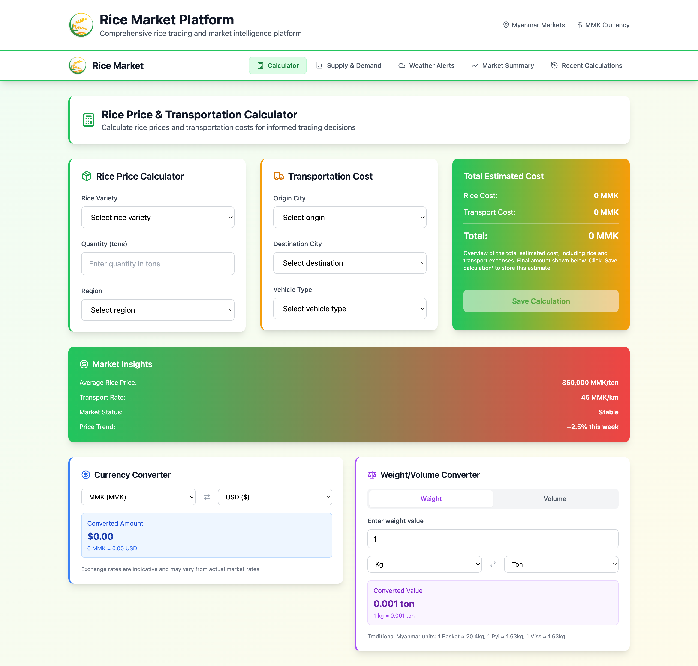

# Rice Market Platform

A comprehensive rice trading and market intelligence platform built with React.js, designed specifically for Myanmar's rice market. This platform provides real-time price calculations, transportation cost analysis, weather impact monitoring, and regional supply/demand insights.

![Rice Market Platform]


## 🌾 Features

### Core Functionality
- **Rice Price Calculator** - Calculate prices based on variety, quantity, and region
- **Transportation Cost Calculator** - Estimate shipping costs with vehicle type and distance
- **Total Cost Estimation** - Combined rice and transportation costs
- **Calculation History** - Save and manage recent calculations with local storage

### Market Intelligence
- **Regional Supply & Demand Analysis** - Monitor market dynamics across Myanmar regions
- **Weather Impact Alerts** - Real-time weather monitoring affecting rice production
- **Market Summary & Analytics** - Comprehensive market trends and performance indicators
- **Currency Converter** - Convert costs between MMK, USD, EUR, THB, and CNY
- **Weight/Volume Converter** - Traditional Myanmar units and international standards

### User Experience
- **Responsive Design** - Optimized for mobile and desktop devices
- **Professional UI** - Agriculture-themed design with modern aesthetics
- **Navigation Menu** - Easy access to all platform features
- **Real-time Updates** - Dynamic calculations and market data

## 🚀 Quick Start

### Prerequisites
- Node.js (v16 or higher)
- npm or yarn package manager

### Installation

1. **Clone the repository**
   ```bash
   git clone https://github.com/yekyawaung91/rice-market-calculator.git
   cd rice-market-platform
   ```

2. **Install dependencies**
   ```bash
   npm install
   ```

3. **Start the development server**
   ```bash
   npm run dev
   ```

4. **Open your browser**
   Navigate to `http://localhost:5173` to view the application

## 📱 Platform Overview

### Calculator Page
The main calculation interface combining rice pricing and transportation costs:

- **Rice Variety Selection**: Choose from 8 popular Myanmar rice varieties
- **Quantity Input**: Specify amount in tons
- **Region Selection**: Select from 8 major Myanmar regions
- **Transportation Planning**: Origin/destination with vehicle type selection
- **Cost Converters**: Currency and weight/volume conversion tools

### Supply & Demand Analysis
Regional market intelligence dashboard:

- **Market Pressure Indicators**: High/Medium/Low pressure analysis
- **Activity Index**: Market engagement levels by region
- **Trading Opportunities**: Buy/sell recommendations
- **Supply/Demand Trends**: Increasing/stable/decreasing indicators

### Weather Impact Monitoring
Weather alerts and production impact analysis:

- **Severity Levels**: High/Medium/Low risk categorization
- **Alert Types**: Flood, drought, storm, and favorable conditions
- **Regional Coverage**: Weather monitoring across all major regions
- **Impact Assessment**: Production and transportation effects

### Market Summary
Comprehensive market analytics and trends:

- **Key Performance Indicators**: Average prices, trading volume, market activity
- **Regional Performance**: Price premiums and market rankings
- **Price Trends**: 30-day historical analysis by variety
- **Market Insights**: Trading recommendations and market drivers

### Calculation History
Complete transaction and calculation management:

- **Search & Filter**: Find specific calculations quickly
- **Statistics Overview**: Usage patterns and averages
- **Export Capabilities**: Download data for analysis
- **Data Management**: Clear history and organize records

## 🛠️ Technical Architecture

### Technology Stack
- **Frontend Framework**: React.js 18 with TypeScript
- **Styling**: Tailwind CSS for responsive design
- **Icons**: Lucide React for consistent iconography
- **Build Tool**: Vite for fast development and building
- **State Management**: React hooks (useState, useEffect)
- **Data Persistence**: Local Storage for calculation history

### Project Structure
```
src/
├── components/           # Reusable UI components
│   ├── Navigation.tsx
│   ├── RicePriceCalculator.tsx
│   ├── TransportationCalculator.tsx
│   ├── CurrencyConverter.tsx
│   ├── WeightVolumeConverter.tsx
│   ├── WeatherAlerts.tsx
│   ├── SupplyDemandIndicators.tsx
│   └── RecentCalculations.tsx
├── pages/               # Page components
│   ├── CalculatorPage.tsx
│   ├── SupplyDemandPage.tsx
│   ├── WeatherPage.tsx
│   ├── MarketSummaryPage.tsx
│   └── HistoryPage.tsx
├── data/               # Mock data and utilities
│   └── mockData.ts
├── types.ts           # TypeScript type definitions
├── App.tsx           # Main application component
└── main.tsx         # Application entry point
```

### Key Components

#### RicePriceCalculator
- Handles rice variety selection and pricing
- Regional price multipliers
- Real-time price calculation
- Quality-based categorization

#### TransportationCalculator
- Distance-based cost calculation
- Vehicle type selection with capacity
- Route optimization
- Cost per kilometer pricing

#### CurrencyConverter
- Multi-currency support (MMK, USD, EUR, THB, CNY)
- Real-time conversion rates
- Swap functionality
- Formatted number display

#### WeightVolumeConverter
- Traditional Myanmar units (Basket, Pyi, Viss)
- International standard units
- Weight and volume conversion modes
- Precise calculation algorithms

## 📊 Data Models

### Rice Varieties
```typescript
interface RiceVariety {
  id: string;
  name: string;
  pricePerTon: number;
  quality: 'Premium' | 'Standard' | 'Basic';
}
```

### Regional Data
```typescript
interface Region {
  id: string;
  name: string;
  priceMultiplier: number;
}
```

### Transportation
```typescript
interface VehicleType {
  id: string;
  name: string;
  capacity: number;
  costPerKm: number;
}
```

### Weather Alerts
```typescript
interface WeatherAlert {
  id: string;
  region: string;
  type: 'drought' | 'flood' | 'storm' | 'favorable';
  severity: 'low' | 'medium' | 'high';
  message: string;
  impact: string;
  date: string;
}
```

## 🎨 Design System

### Color Palette
- **Primary Green**: Agriculture and growth theme
- **Amber/Gold**: Rice and harvest colors
- **Earth Tones**: Natural, organic feel
- **Status Colors**: Red (alerts), Yellow (warnings), Green (positive)

### Typography
- **Headings**: Bold, clear hierarchy
- **Body Text**: Readable, professional
- **Data Display**: Monospace for numbers and calculations

### Layout Principles
- **Card-based Design**: Clean, organized information blocks
- **Responsive Grid**: Mobile-first approach
- **Consistent Spacing**: 8px spacing system
- **Visual Hierarchy**: Clear information prioritization

## 🔧 Configuration

### Environment Variables
Create a `.env` file for configuration:
```env
VITE_API_BASE_URL=your_api_endpoint
VITE_CURRENCY_API_KEY=your_currency_api_key
VITE_WEATHER_API_KEY=your_weather_api_key
```

### Customization
- **Rice Varieties**: Update `src/data/mockData.ts`
- **Regions**: Modify regional data and price multipliers
- **Currency Rates**: Configure exchange rates
- **Vehicle Types**: Adjust transportation options

## 📈 Future Enhancements

### Planned Features
- **User Authentication**: Secure login and user profiles
- **Trading Platform**: Buyer/seller marketplace
- **Real-time Data**: Live price feeds and market data
- **Mobile App**: React Native implementation
- **API Integration**: Backend service connectivity
- **Advanced Analytics**: Machine learning price predictions

### Technical Improvements
- **State Management**: Redux or Zustand implementation
- **Testing**: Unit and integration test coverage
- **Performance**: Code splitting and optimization
- **Accessibility**: WCAG compliance improvements
- **Internationalization**: Multi-language support

## 🤝 Contributing

We welcome contributions to improve the Rice Market Platform:

1. **Fork the repository**
2. **Create a feature branch**: `git checkout -b feature/new-feature`
3. **Commit changes**: `git commit -m 'Add new feature'`
4. **Push to branch**: `git push origin feature/new-feature`
5. **Submit a pull request**

### Development Guidelines
- Follow TypeScript best practices
- Maintain consistent code formatting
- Add proper type definitions
- Update documentation for new features
- Test on multiple devices and browsers

## 📄 License

This project is licensed under the MIT License - see the [LICENSE](LICENSE) file for details.

## 🙏 Acknowledgments

- **Myanmar Rice Industry**: For market insights and requirements
- **Pexels**: For high-quality stock photography
- **Lucide**: For beautiful, consistent icons
- **Tailwind CSS**: For rapid UI development
- **React Community**: For excellent documentation and support

## 📞 Support

For questions, issues, or feature requests:

- **GitHub Issues**: [Create an issue](https://github.com/your-repo/issues)
- **Email**: support@ricemarketplatform.com
- **Documentation**: [Wiki](https://github.com/your-repo/wiki)

---

**Built with ❤️ for Myanmar's rice trading community**